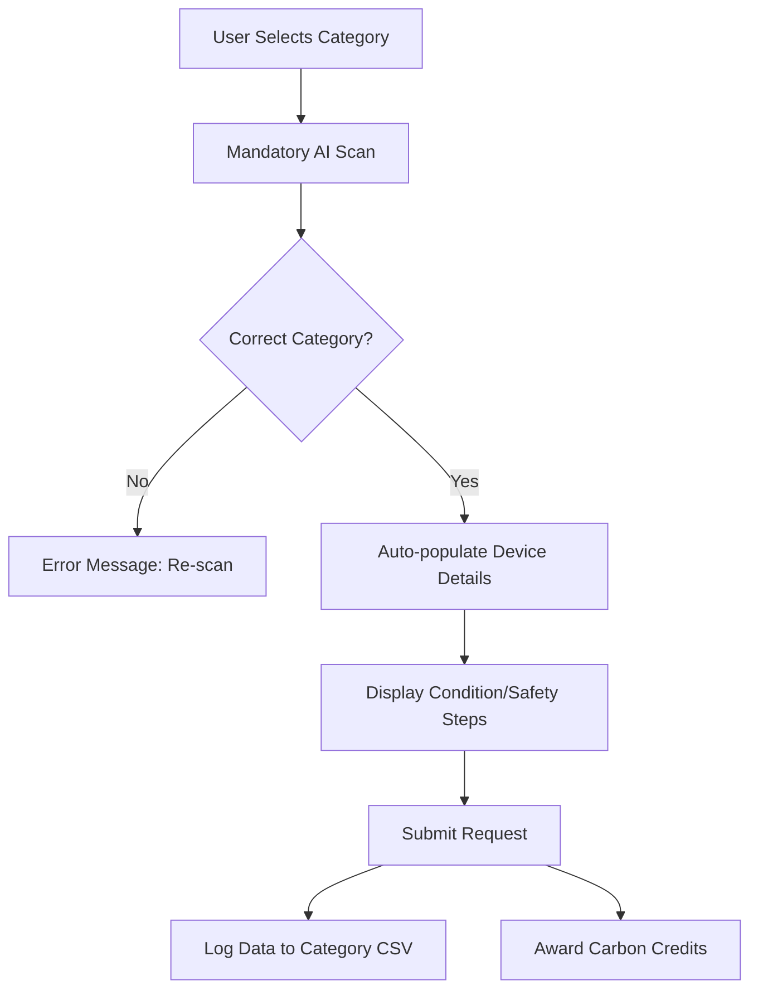

# E-Locator Project Report: Advanced E-Waste Management System

## Project Overview
**E-Locator** is a standalone, high-fidelity web application built from the ground up to revolutionize the e-waste recycling ecosystem. It is a fully independent project that combines cutting-edge AI device identification with custom-tailored recycling workflows, ensuring that electronic waste is handled with maximum precision and environmental safety. This version represents a complete transition to a self-contained architecture, free from third-party development platform dependencies.

---

## 🎨 Design Philosophy: Green, White & Black
The application utilizes a custom-built, premium design system focused on "Eco-Minimalism".
- **Primary Color**: Emerald Green (representing sustainability and growth).
- **Secondary Colors**: Pure White and Deep Black (representing clarity and professional integrity).
- **UI Elements**: Rounded corners (24px+), glassmorphism effects, and subtle micro-animations for a fluid user experience.

---

## 🚀 Core Features

### 1. AI-Driven Device Identification
The heart of the application is a mandatory **"Scan First"** workflow.
- **Strict Matching**: The AI scanner is programmed with category-specific logic. For example, the **Laptops & Computers** scanner strictly enforces identification of actual computing units (Laptops, Desktops, MacBooks) and rejects peripherals like mice or keyboards.
- **Image Archiving**: Every scanned device is automatically archived to the server (`user-device-pics/`) with a timestamp and username for audit purposes.

### 2. Autonomous Auto-Population
To minimize user friction, the AI acts as an autonomous assistant:
- **Auto-Fill**: Once a scan is successful, the device's **Model Name**, **Category**, and **Type** are automatically populated into the subsequent form steps.
- **Verification Badge**: A "VERIFIED" badge appears next to the data to reassure the user of the AI's accuracy.

### 3. Category-Specific Workflows
Every type of e-waste has a unique handling requirement:
- **Batteries**: Includes a mandatory **Safety & Identification** checklist before submission.
- **Large Appliances**: Features a dedicated **Logistics & Pickup** scheduling system with address validation.
- **Smartphones & Laptops**: Focuses on hardware specs and condition reporting.
- **TVs & Displays**: Screen-specific identification.

### 4. Enterprise-Grade Data Logging
The application implements a robust backend simulation via Vite middleware:
- **Category CSVs**: Every submission is routed to a specific CSV file (e.g., `smartphones___tablets.csv`) in the `recycle-logs/` directory.
- **Data Integrity**: Each entry includes a precise timestamp, the user's ID, and a JSON-flattened data blob of the device details.

---

## 🛠️ Technical Stack
- **Frontend**: React 18, TypeScript, Tailwind CSS, Lucide-React for iconography.
- **State Management**: React Query (TanStack) and custom Hooks.
- **Backend/API**: 
    - **Vite Custom Middleware**: Handles `/api/log-recycle` and `/api/save-image`.
    - **Supabase Edge Functions**: Powers the `identify-device` AI logic.
- **Auth**: Integrated Supabase Auth for persistent user profiles and rewards.

---

## 📊 System Logic Flow

---

## 📂 Project Structure Highlights
- `/src/pages/RecycleWorkflow.tsx`: The orchestrator of all category-specific logic.
- `/src/components/DeviceIdentifier.tsx`: The AI scanning and validation core.
- `/recycle-logs/`: Real-time storage of recycling submissions.
- `/user-device-pics/`: Repository for all identified device imagery.

---
**Report generated for:** E-Locator Admin Team
**Date:** February 2026
